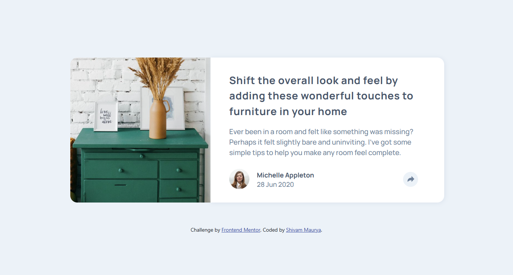
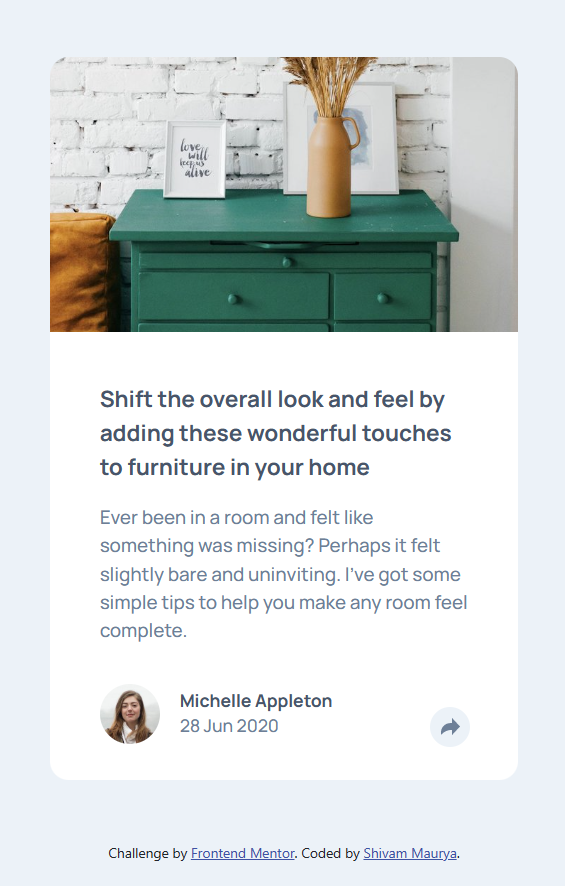
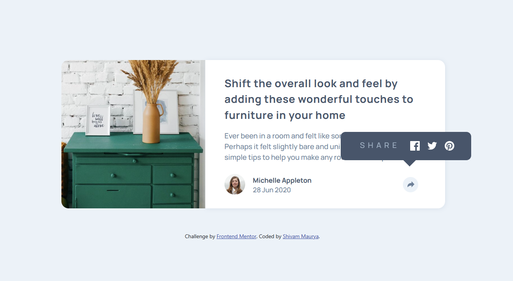
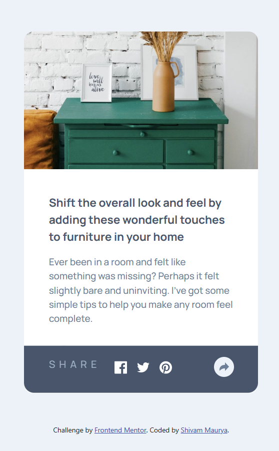

# Frontend Mentor - Article preview component solution

This is a solution to the [Article preview component challenge on Frontend Mentor](https://www.frontendmentor.io/challenges/article-preview-component-dYBN_pYFT).

## Table of contents

- [Overview](#overview)
  - [The challenge](#the-challenge)
  - [Screenshot](#screenshot)
  - [Links](#links)
- [My process](#my-process)
  - [Built with](#built-with)
  - [What I learned](#what-i-learned)
- [Author](#author)

## Overview

### The challenge

Users should be able to:

- View the optimal layout for the component depending on their device's screen size
- See the social media share links when they click the share icon

### Screenshot

| Desktop  | Mobile |
| ------------- | ------------- |
|   |  |

| Desktop Clicked  | Mobile Clicked |
| ------------- | ------------- |
|   |  |

### Links
- [Github URL](https://github.com/ShivamManiMaurya/article-preview-component)
- [Live-site URL](https://coruscating-queijadas-e3457a.netlify.app/)

## My process

### Built with

- Semantic HTML5 markup
- CSS custom properties
- Flexbox
- Mobile-first workflow
- [React](https://reactjs.org/) - JS library

### What I learned

- Changing the html dynamically with react functions
- Got more familiar with useState function
- Animation property
- ::after and ::before property
- transform property

## Author

- Github - [Shivam Maurya](https://github.com/ShivamManiMaurya)
- Frontend Mentor - [@shivammaurya](https://www.frontendmentor.io/profile/ShivamManiMaurya)